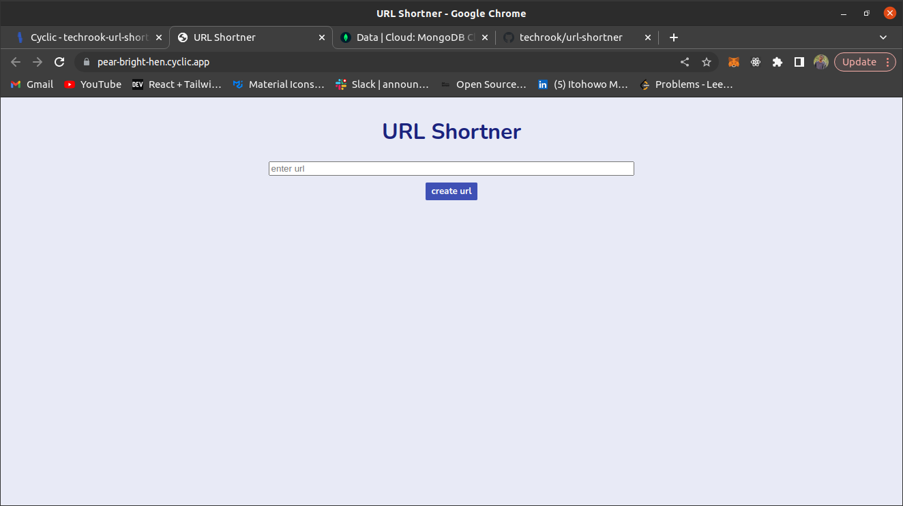
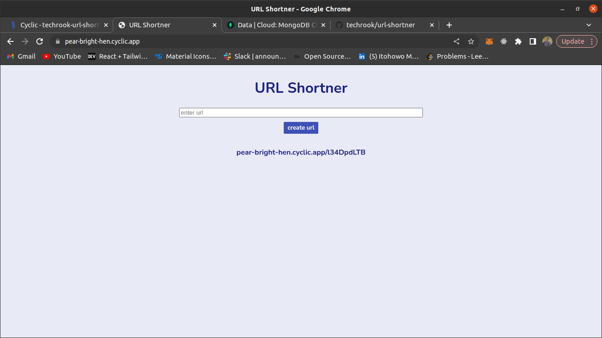

<h1 align="center">{23 URL Shortner}</h1>

## Description 

   
 A web application that shortens Uniform Resource Locators (url). and this shorten url are stored so they can be use in the future

## How to use 

Enter the desired url you would love to shorten in the input field and click the button (create url)

 the web application is going to return a shorten url which you could use

## Acknowledgements

-
 this website was inspired by Truly Mittal 

- GitHub [@trulymittal](https://{github.com/trulymittal})
-repo [repo](https://github.com/trulymittal/short-url-nodejs-mongodb)
## Contact

- GitHub [@techrook](https://{github.com/techrook})
- Twitter [@itohowo23](https://{twitter.com/itohowo23})
